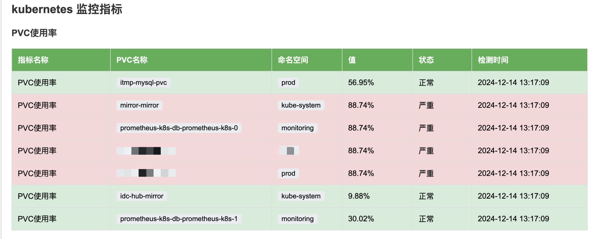

# Prometheus 监控报告生成器
> Prometheus Automated Inspection
## 项目简介
这是一个基于 Prometheus 的监控报告自动生成工具，可以自动收集、分析指标数据并生成可视化的 HTML 报告。该工具旨在简化监控数据的收集和展示过程，帮助运维人员快速了解系统状态。

## 报告样式
[报告样式](reports/inspection_report_20241214_131709.html)



## 功能特点
- 支持多种指标类型的监控（基础资源、Kubernetes、应用服务等）
- 自动计算指标状态和告警级别（正常、警告、严重）
- 生成包含数据表格和图表的 HTML 报告
- 支持自定义指标阈值和标签别名
- 灵活的配置文件系统
- 支持多维度数据分析和展示
- 自动计算关键统计指标（最大值、最小值、平均值等）
- 美观的可视化界面，支持响应式布局

## 系统要求
- Go 1.22 或更高版本
- 可访问的 Prometheus 服务器
- 现代浏览器（支持 HTML5 和 JavaScript）
- 至少 512MB 可用内存
- 50MB 可用磁盘空间

## 配置说明
配置文件采用 YAML 格式，主要包含以下几个部分：

### Prometheus 配置
在 `config/config.yaml` 中配置 Prometheus 服务器地址和监控指标。

```yaml
prometheus_url: "http://prometheus.k8s.kubehan.cn"

metric_types:
  - type: "基础资源使用情况"
    metrics:
      - name: "CPU使用率"
        description: "节点CPU使用率统计"
        query: "100 - (avg by(instance) (irate(node_cpu_seconds_total{mode='idle'}[5m])) * 100)"
        trend_query: "100 - (avg by(instance) (irate(node_cpu_seconds_total{mode='idle'}[5m])) * 100)[6h:5m]"
        threshold: 80
        unit: "%"
        labels:
          instance: "节点"
      # 其他指标...
```

### 指标说明
每个指标可以配置以下内容：
- `name`: 指标名称
- `description`: 指标描述
- `query`: 用于表格显示的即时查询
- `trend_query`: 用于图表显示的趋势查询
- `threshold`: 指标阈值
- `unit`: 指标单位
- `labels`: 标签别名
- `threshold_type`: 阈值比较方式: "greater", "less", "equal", "greater_equal", "less_equal" 

```txt
greater: 表示值必须大于阈值才被视为 "critical" 状态。
greater_equal: 表示值必须大于或等于阈值才被视为 "critical" 状态。
less: 表示值必须小于阈值才被视为 "normal" 状态。
less_equal: 表示值必须小于或等于阈值才被视为 "normal" 状态。
equal: 表示值必须等于阈值才被视为 "normal" 状态。
```

## 快速开始

1. 克隆仓库：
   ```bash
   git clone https://github.com/kubehan/PromAI.git
   cd PromAI
   ```

2. 安装依赖：
   ```bash
   go mod download
   ```

3. 修改配置文件：
   ```bash
   cp config/config.example.yaml config/config.yaml
   # 编辑 config.yaml 设置 Prometheus 服务器地址和监控指标
   ```

4. 构建并运行：
   ```bash
   go build
   ./prometheus-report-generator -config config/config.yaml
   ```

5. 查看报告：
   生成的报告将保存在 `reports` 目录下。

## 使用示例
在配置文件中添加所需的监控指标后，运行程序将生成 HTML 报告。报告中将包含各个指标的当前状态、历史趋势图表以及详细的表格数据。
1. 修改配置文件中的Prometheus地址为自己的地址
2. 修改配置文件中的指标
3. 运行程序 默认运行在8091端口，通过访问http://localhost:8091/getreport 查看报告
```bash
go build -o PromAI main.go
./PromAI -config config/config.yaml
```


# Prometheus Automated Inspection 未来新功能规划列表
1. 多数据源支持
2. 自定义仪表板
3. 历史数据存储
4. 智能告警
5. API 接口
6. 用户角色和权限管理
7. 数据导出功能
8. 集成 CI/CD 流程
9. 可视化组件库
10. 多语言支持
11. 移动端支持
12. 社区和插件支持
13. 性能优化
14. 用户反馈和建议收集
15. xxx


## 贡献
欢迎任何形式的贡献！请提交问题、建议或拉取请求。

## 许可证
该项目采用 MIT 许可证，详细信息请查看 LICENSE 文件。
